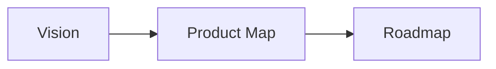
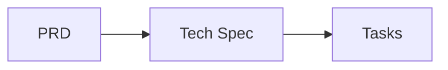
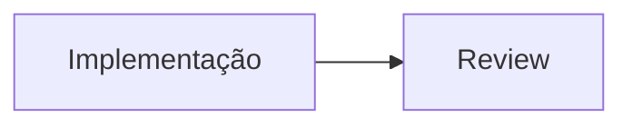

# AI-SDD Template — Rails 8

> Template de desenvolvimento orientado por especificações com IA para projetos **Rails 8 + Hotwire + PostgreSQL + Tailwind CSS**.

---

## O que é AI-SDD?

**AI-Specification-Driven Development** é uma metodologia onde a IA conduz o ciclo completo de desenvolvimento — da visão do produto até o code review — com base em documentos de especificação estruturados e versionados.

Em vez de pedir para a IA "criar uma feature", você segue um fluxo controlado:

```
Vision → Product Map → Roadmap → PRD → Tech Spec → Tasks → Implementação → Review
```

Cada etapa gera um documento que alimenta a próxima, garantindo rastreabilidade, consistência e qualidade.

---

## Estrutura do Template

```
.
├── AGENTS.md                        # Diretrizes de desenvolvimento (adapte ao seu projeto)
├── README.md                        # Este arquivo
└── .opencode/
    ├── commands/                     # Comandos de automação (atalhos para skills)
    │   ├── cria-vision.md           # /cria-vision — cria documento de visão
    │   ├── cria-product-map.md      # /cria-product-map — mapeia fluxos de usuário
    │   ├── cria-roadmap.md          # /cria-roadmap — organiza fases de implementação
    │   ├── cria-prd.md              # /cria-prd — cria PRD de funcionalidade
    │   ├── cria-techspec.md         # /cria-techspec — cria especificação técnica
    │   ├── cria-tasks.md            # /cria-tasks — decompõe em tarefas
    │   ├── executar-task.md         # /executar-task — implementa uma tarefa
    │   └── executar-review.md       # /executar-review — code review via GitHub PR
    └── skills/                       # Skills com procedimentos detalhados
        ├── cria-vision/             # Documento de visão do produto
        ├── cria-product-map/        # Mapa de fluxos de usuário
        ├── cria-roadmap/            # Roadmap de fases
        ├── cria-prd/                # PRD (Product Requirements Document)
        │   └── assets/
        │       └── prd-template.md
        ├── cria-techspec/           # Especificação técnica
        │   └── assets/
        │       └── techspec-template.md
        ├── cria-tasks/              # Decomposição em tarefas
        │   └── assets/
        │       ├── tasks-template.md
        │       └── task-template.md
        ├── executa-task/            # Implementação de tarefas
        └── executa-review/          # Code review
            ├── assets/
            │   └── review-report-template.md
            └── references/
                └── code-quality-checklist.md
```

Ao executar o fluxo, a seguinte estrutura é gerada no seu projeto:

```
ai-sdd/
├── system/                          # Documentos de sistema (gerados uma vez)
│   ├── vision.md                    # Visão do produto
│   ├── product_map.md               # Mapa de fluxos
│   └── roadmap.md                   # Roadmap de fases
└── prd-[feature-slug]/              # Um diretório por funcionalidade
    ├── prd.md                       # Requisitos de produto
    ├── techspec.md                  # Especificação técnica
    ├── tasks.md                     # Resumo de tarefas
    └── tasks/                       # Tarefas individuais
        ├── 1_task.md
        ├── 2_task.md
        └── ...
```

---

## Como Usar

### 1. Copie para o seu projeto Rails

Copie a pasta `.opencode/` e o `AGENTS.md` para a raiz do seu projeto Rails:

```bash
cp -r .opencode/ /caminho/do/seu/projeto/
cp AGENTS.md /caminho/do/seu/projeto/
```

### 2. Adapte o AGENTS.md

O `AGENTS.md` vem pré-configurado para a stack **Rails 8.1 + Ruby 4.0.2 + PostgreSQL + Tailwind + Hotwire**. Adapte os seguintes pontos ao seu projeto:

- **Linha 1-3**: Nome e descrição do projeto
- **Seção 2**: Nomes dos bancos de dados (`[app_name]_development`, etc.)
- **Seção 4**: Estrutura de diretórios específica
- **Seção 10**: Nomes dos bancos Solid em produção

### 3. Execute o fluxo AI-SDD

Use os comandos na ordem do fluxo. No [OpenCode](https://github.com/nicholasgriffintn/opencode), execute como slash commands:

| Etapa | Comando | O que faz |
|-------|---------|-----------|
| 1 | `/cria-vision` | Define problema, público e proposta de valor |
| 2 | `/cria-product-map` | Mapeia fluxos de usuário por persona |
| 3 | `/cria-roadmap` | Organiza implementação em fases |
| 4 | `/cria-prd` | Cria PRD para uma funcionalidade |
| 5 | `/cria-techspec` | Traduz PRD em decisões arquiteturais |
| 6 | `/cria-tasks` | Decompõe em tarefas incrementais |
| 7 | `/executar-task` | Implementa uma tarefa com testes |
| 8 | `/executar-review` | Code review via PR no GitHub |

> **Nota**: Cada comando ativa uma skill que guia a IA por um processo estruturado com perguntas de esclarecimento, alinhamento com o usuário e checklists de qualidade.

---

## Fluxo Detalhado

### Fase de Planejamento (uma vez por projeto)



- **Vision** — Define o problema, público-alvo e proposta de valor. Documento estável que não muda frequentemente.
- **Product Map** — Mapeia os fluxos de usuário organizados por persona. Descreve comportamento, não implementação.
- **Roadmap** — Organiza as funcionalidades em fases incrementais com dependências e prioridades.

### Fase de Especificação (uma vez por funcionalidade)



- **PRD** — Define O QUE e PORQUÊ de uma funcionalidade. Requisitos funcionais numerados (RF-XXX) para rastreabilidade.
- **Tech Spec** — Define COMO implementar. Arquitetura, modelos de dados, rotas, estratégia de testes.
- **Tasks** — Decompõe em tarefas incrementais. Cada tarefa é um entregável funcional com testes.

### Fase de Execução (uma vez por tarefa)



- **Implementação** — Executa a tarefa seguindo PRD + Tech Spec + AGENTS.md. Inclui testes e lint.
- **Review** — Revisão automatizada via GitHub MCP com comentários inline no PR.

---

## Stack Suportada

Este template é pré-configurado para:

| Tecnologia | Versão | Uso |
|-----------|--------|-----|
| Rails | 8.1 | Framework web |
| Ruby | 4.0.2 | Linguagem |
| PostgreSQL | — | Banco de dados |
| Tailwind CSS | — | Estilização (via `tailwindcss-rails`) |
| Hotwire | Turbo + Stimulus | Interatividade |
| Propshaft | — | Asset pipeline |
| Importmap | — | Gerenciamento JS |
| Minitest | — | Testes unitários e de integração |
| Capybara + Selenium | — | Testes E2E |
| RuboCop Omakase | — | Linting |
| Kamal | — | Deploy (Docker) |

> Para usar com outra stack, adapte o `AGENTS.md`, os templates em `assets/` e as referências nos skills de execução (`executa-task`, `executa-review`).

---

## Compatibilidade com Ferramentas de IA

Este template usa o formato `.opencode/` (commands + skills) compatível com o [OpenCode](https://github.com/nicholasgriffintn/opencode). Os skills também podem ser usados como referência para outras ferramentas de IA que suportem instruções em markdown, como:

- **Cursor** — Copie os skills para `.cursor/rules/`
- **Windsurf** — Copie para `.windsurfrules/`
- **Cline / Roo Code** — Use como instruções customizadas
- **Claude Code** — Use o `AGENTS.md` como `CLAUDE.md`

O conteúdo dos skills é agnóstico à ferramenta — são procedimentos sequenciais em markdown que qualquer LLM pode seguir.

---

## Licença

MIT
